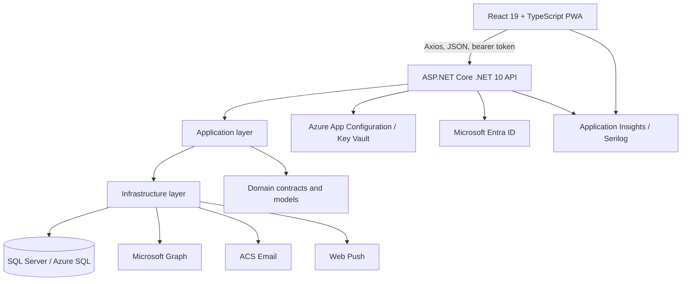

# Workslip containers and runtime components

**Status:** Current implementation with known gaps  
**Owner:** Workslip engineering  
**Last verified:** 2026-07-23  
**Review cadence:** Monthly and on deployment-topology changes

## Container view

## Components

| Component | Implemented responsibility | Runtime/data ownership |
|---|---|---|
| Frontend PWA | React routes, forms, role-aware UI, API calls, service worker, push subscription and client telemetry. | Browser cache and local auth storage. No verified durable offline job-draft contract. |
| API host | Authentication, authorization, endpoint registration, HTTP mapping, rate limiting, correlation IDs, security headers and PDF generation. | Request-scoped identity and in-memory/hybrid caches. |
| Application layer | Validation and business orchestration using `Ardalis.Result`. | Business decisions during a request; no direct HTTP concerns. |
| Domain layer | Roles, job statuses, row/contracts and shared domain types. | No external resources. |
| Infrastructure layer | EF Core repositories, transactions, SQL resiliency, email, push, audit interception and hosted cleanup/delivery workers. | SQL persistence and external integration calls. |
| SQL database | Organizations, users, customers, jobs, assignments, worksheets, reference data, notifications, audit-related data, job views and idempotency records. | Authoritative application data. |
| Azure configuration | Optional external configuration and Key Vault references loaded during startup. | Configuration and secrets. |
| Entra ID | External identity token issuance. | External identity records and tokens. |
| Microsoft Graph | Entra invitation/user lifecycle integration. | External directory data. |
| ACS Email | Invitation and operational email delivery. | External delivery metadata. |
| Web Push | Browser notification delivery. | Subscription endpoints and delivery result. |
| Application Insights/Serilog | API and frontend telemetry, request correlation and error diagnostics. | Operational telemetry; retention is not defined in this document. |

## API startup sequence

1. Build configuration and Azure credential.
2. Optionally load Azure App Configuration and Key Vault references.
3. Register CORS, authentication, logging, application and infrastructure services.
4. Create a scope and initialize the database schema.
5. Verify database connectivity.
6. Seed development data only when the environment is `Development`.
7. Configure middleware and map endpoints.
8. Map development/OpenAPI endpoints through the current `ConfigureDevEnvironment` implementation.
9. Start the web host.

## Middleware order

The implemented pipeline applies security headers, production HSTS/HTTPS redirection, correlation IDs, Serilog request logging, global exception handling, routing, CORS, rate limiting, authentication and authorization.

## Persistence and transactions

- EF Core targets SQL Server and uses the API assembly for migrations.
- An audit interceptor is attached to the DbContext.
- Repository queries are responsible for organization scoping.
- Application transactions are available through `IApplicationTransactionFactory`.
- Job status transitions use a serializable transaction and return whether a transition changed state.
- Mutating job endpoints require an `Idempotency-Key` and persist replay information in `IdempotencyRecords`.

## Cache ownership

- The backend uses `HybridCache` for job/report reads with short local expirations and tag-based invalidation.
- HTTP responses use private ETags for selected job endpoints.
- The PWA precaches built static assets. It does not currently establish a supported offline mutation queue.

## Deployment evidence

- Backend: GitHub Actions restores, builds, publishes an artifact and deploys it to Azure Web Apps.
- Frontend: Vite builds the PWA; the hosting pipeline is not represented in the inspected GitHub workflows.
- Database: schema initialization runs in API startup. There is no separate verified migration deployment job or automated database rollback.

## Explicitly not claimed

- Multi-region operation.
- Verified database backup/restore.
- Guaranteed offline form submission.
- Implemented inventory/material domain.
- A production-safe dev/OpenAPI endpoint boundary.
