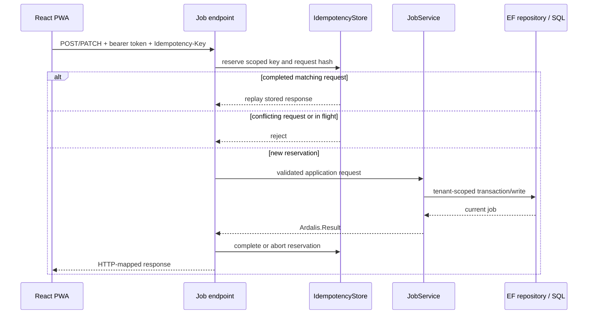

# Domain model and central dataflows

**Status:** Current implementation with proposed areas called out  
**Owner:** Workslip engineering  
**Last verified:** 2026-07-23  
**Review cadence:** Monthly and whenever persistence or core workflows change

## Tenant and identity boundary

The authenticated request is translated to an `ICurrentUserContext` containing:

- Workslip user ID
- organization ID
- role

Application services take the organization ID from this server-side context. Repositories must include the organization ID when loading or mutating tenant-owned records. A client-supplied organization ID is not a trusted boundary.

## Core persisted concepts

| Concept | Ownership and purpose |
|---|---|
| Organization | Tenant root. |
| User | Belongs to an organization and carries a Workslip role. |
| Customer | Tenant-owned customer/contact data. |
| Job report | Tenant-owned work slip with status, customer snapshot, observations, work details and deletion state. |
| Assignment | Links a job to eligible users in the same organization. |
| Worksheet | Tenant-owned time/work entry linked to a job. |
| Job event | History/audit-style event stream for job activity. |
| Job view | Per-user seen state for jobs. |
| Reference data | Work kinds, closure flags, installation definitions and mappings. |
| Notification queue/delivery log | In-app and push delivery lifecycle. |
| Push subscription | Browser push endpoint associated with a Workslip user. |
| Invite token | Invitation lifecycle and external identity enrollment. |
| Idempotency record | Request hash, reservation, response and expiry for mutation replay protection. |

Inventory/material entities do not exist in the current DbContext.

## Job creation and update

Mutation scopes include organization, user and resource where relevant. Missing idempotency keys on protected job mutations return HTTP `428 Precondition Required`.

## Current job status behaviour

The persisted status values are:

- `Draft`
- `InReview`
- `Approved`
- `Rejected`

The current implementation validates that the requested target is one of these enum values, but it does **not** enforce a from-status/to-status transition matrix. The service runs submit-readiness validation before every status change and the repository then writes the requested target in a serializable transaction.

| Current behaviour | Result |
|---|---|
| Target equals current status | Treated as an idempotent no-op; no duplicate cache invalidation or notification. |
| First transition to `InReview` | Sets `SubmittedAt`. |
| Other allowed enum target | Written without checking the previous status. |
| Missing tenant-owned job | `NotFound`. |
| Job is not submit-ready | Validation result; no transition. |

This behaviour is documented, not endorsed. ADR 0001 records the required product decision and recommended transition boundary.

## Status-change side effects

After a changed transition:

1. Job caches are invalidated.
2. The updated summary is built from the persisted job, reference data and worksheets.
3. Notification logic may enqueue messages for relevant users.
4. Duplicate requests that resolve to the same target skip these repeated side effects.

## Read flow and caching

- Job list/detail reads are tenant-scoped.
- Selected responses use private ETags and may return `304 Not Modified`.
- Backend job caches use short expirations and organization/job tags.
- Cache entries are derived data. SQL remains authoritative.

## Audit ownership

The EF DbContext installs an `AuditInterceptor`. Request identity is available through audit build context. Operational request logs carry trace/request/correlation information. Audit retention, privileged access and legal retention are not yet decided.

## PDF and export

Job PDFs are generated by the API from the current job summary and returned directly as a file response. The inspected flow does not persist generated PDFs as an authoritative data store.

## Notifications

- Notification records and delivery logs are stored in SQL.
- A hosted worker delivers web push messages.
- Browser subscriptions are managed through API endpoints.
- The frontend service worker displays push payloads and navigates to their target URL.

## Offline and PWA behaviour

The service worker precaches static build assets and reports that the application shell is offline-ready. This does not mean business mutations are offline-capable.

Current limitations:

- no verified tenant/user/job-scoped durable draft store
- no supported generic offline mutation queue
- submit requires network/API availability
- a new service worker currently activates automatically and sends a reload message to open clients

ADR 0004 records the proposed safe draft/update principle.

## Data ownership summary

| Data | Authoritative owner |
|---|---|
| Jobs, worksheets, users, customers, reference data | SQL database through tenant-scoped API operations |
| Authentication token | Entra ID or Workslip local JWT issuer; browser stores the active token |
| API contract | Registered backend endpoints and generated OpenAPI document |
| Client generated API code | Orval output generated from OpenAPI |
| Cache | Disposable derived state |
| PDF | Generated representation of current persisted job data |
| Push delivery | SQL queue/log plus external push provider result |
| Telemetry | Application Insights/Serilog; retention and access need separate governance |
