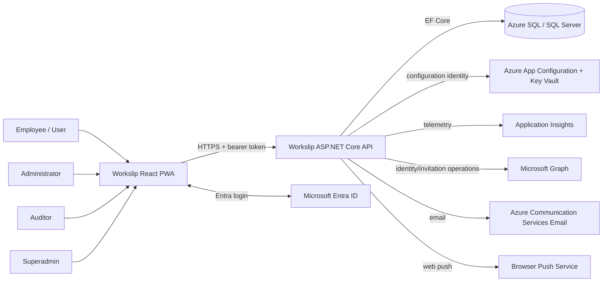

# Workslip system context

**Status:** Current implementation with explicitly listed gaps  
**Owner:** Workslip engineering  
**Last verified:** 2026-07-23  
**Review cadence:** Monthly and whenever authentication, hosting, integrations or tenant boundaries change  
**Source of truth:** Current frontend/backend source, EF mappings and GitHub workflows

## Purpose

Workslip is a tenant-aware PWA and API for creating, completing, reviewing and reporting work slips. This document describes implemented boundaries. Proposed inventory and advanced offline behaviour are not part of the current system.

## Actors and roles

| Role | Implemented purpose |
|---|---|
| `User` | Normal job and worksheet operations. |
| `Admin` | User-level access plus administrative operations. |
| `Auditor` | Read-oriented access to jobs and reports. |
| `Superadmin` | Highest configured application role. Destructive or cross-tenant behaviour must still be enforced explicitly by endpoint/service code. |

Role hierarchy is configuration-driven. Endpoint groups use named policies such as `RequireReadAccess`, `RequireUser`, `RequireAdmin` and `RequireSuperAdmin`.

## Trust boundaries

1. **Browser to API:** The browser is untrusted. Organization and user identifiers must come from validated claims, not request payloads.
2. **API to SQL:** The API has privileged database access. Tenant isolation is therefore an application and query responsibility as well as a schema concern.
3. **API to Azure services:** App Configuration, Key Vault, Graph, email and telemetry use application credentials or managed identity. Secret values must not be stored in repository documentation.
4. **External identity:** Entra tokens and locally issued JWTs are accepted through a combined authentication scheme. The API enriches the current request with Workslip user and organization claims.
5. **Push notifications:** Browser push endpoints are external delivery infrastructure. Payloads must not contain sensitive job data beyond what is acceptable on a locked device.

## Current hosting evidence

- The backend production workflow builds a .NET 10 API and deploys an artifact to an Azure Web App named from `api-npteknik-{environment}`.
- The frontend is a Vite PWA. The repository contains a production CORS default for `https://workslip-v2-0.vercel.app`, but frontend hosting configuration is not maintained as infrastructure-as-code in this repository.
- SQL Server is accessed through EF Core. Connection details are resolved from configuration and may be supplied through Azure App Configuration and Key Vault.

## Known gaps and risks

- OpenAPI, Scalar and `/api/dev` endpoints are currently mapped without an active environment guard. This is implemented behaviour and should be corrected before treating production as hardened.
- Entra issuer validation is disabled for the configured multitenant flow. Audience validation remains configured; the intended tenant acceptance policy needs a dedicated security review.
- The repository does not prove production backup, restore, RPO or RTO.
- A dedicated isolated demo environment is planned elsewhere but is not verified here as deployed.
- Inventory/material management is proposed, not implemented.
